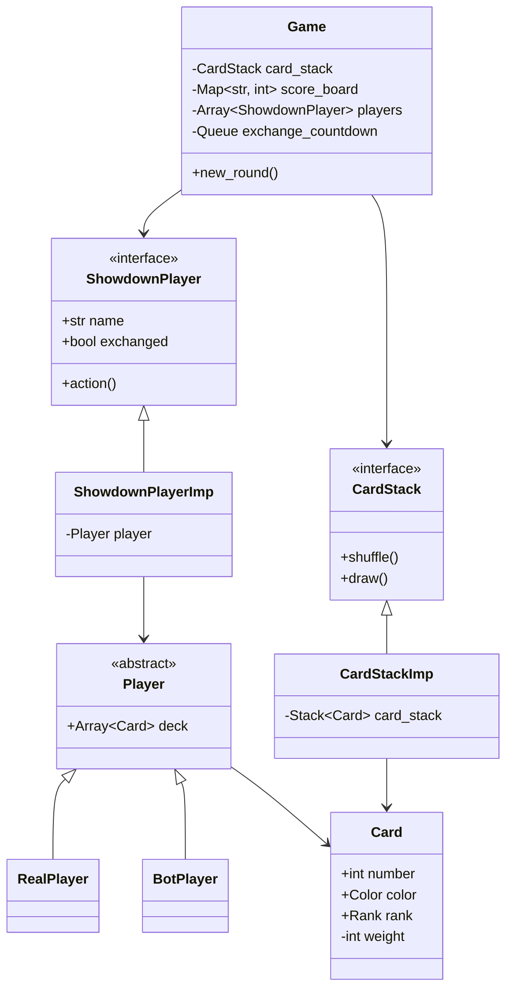

# 專案設計

```mermaid
classDiagram
    class Game {
        -CardStack card_stack
        -Map~str, int~ score_board
        -Array~ShowdownPlayer~ players
        -Queue exchange_countdown

        +new_round()
    }

    class CardStack {
        <<interface>>
        +shuffle()
        +draw()
    }

    class ShowdownPlayer {
        <<interface>>
        +str name
        +bool exchanged
        +action()
    }
    
    Game --> ShowdownPlayer
    Game --> CardStack

    %% ----- %%

    class Player {
        <<abstract>>
        +Array~Card~ deck
    }
    class RealPlayer
    class BotPlayer

    Player <|-- RealPlayer
    Player <|-- BotPlayer

    %% ----- %%
    
    class Card {
        +int number
        +Color color
        +Rank rank
        -int weight
    }

    %% ----- %%

    class ShowdownPlayerImp {
        -Player player
    }

    class CardStackImp {
        -Stack~Card~ card_stack
    }
    ShowdownPlayer <|-- ShowdownPlayerImp
    CardStack <|-- CardStackImp
    ShowdownPlayerImp --> Player
    Player --> Card
    CardStackImp --> Card
```