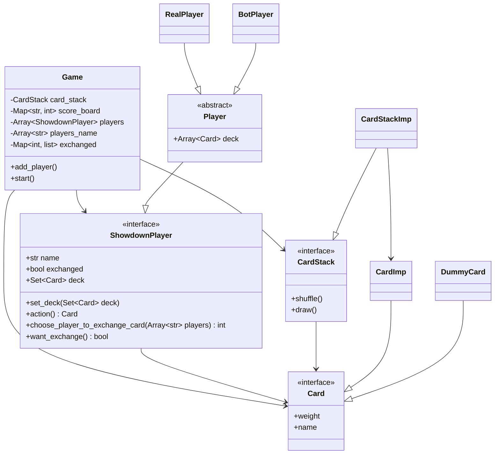

# 專案設計

```mermaid
classDiagram
    class Game {
        -CardStack card_stack
        -Map~str, int~ score_board
        -Array~ShowdownPlayer~ players
        -Array~str~ players_name
        -Map~int, list~ exchanged

        +add_player()
        +start()
    }

    class Card {
        <<interface>>
        +weight
        +name
    }

    class CardStack {
        <<interface>>
        +shuffle()
        +draw()
    }

    class ShowdownPlayer {
        <<interface>>
        +str name
        +bool exchanged
        +Set~Card~ deck
        
        +set_deck(Set~Card~ deck)
        +action() Card
        +choose_player_to_exchange_card(Array~str~ players) int
        +want_exchange() bool
    }
    
    Game --> ShowdownPlayer
    Game --> CardStack
    Game --> Card
    ShowdownPlayer --> Card
    CardStack --> Card

    %% ----- %%

    class Player {
        <<abstract>>
        +Array~Card~ deck
    }
    class RealPlayer
    class BotPlayer

    Player --|> ShowdownPlayer
    RealPlayer --|> Player
    BotPlayer --|> Player

    %% ----- %%
    
    class CardImp
    class DummyCard
    class CardStackImp

    CardImp --|> Card
    DummyCard --|> Card
    CardStackImp --|> CardStack
    CardStackImp --> CardImp
```