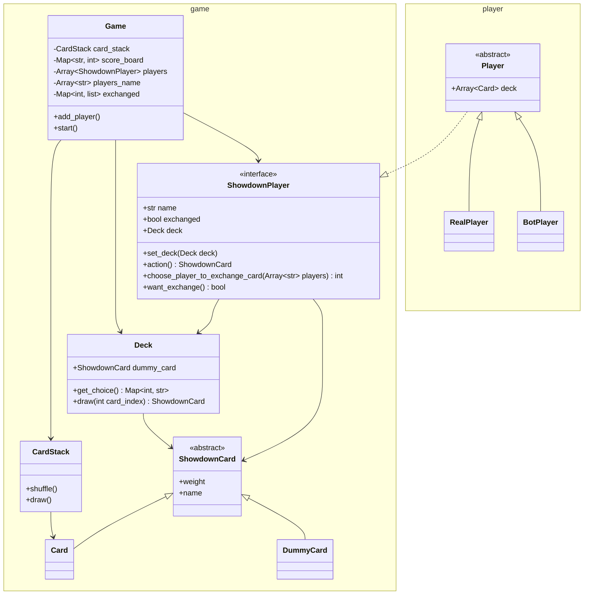

# 專案設計

```mermaid
classDiagram
    namespace game{
        class Game {
            -CardStack card_stack
            -Map~str, int~ score_board
            -Array~ShowdownPlayer~ players
            -Array~str~ players_name
            -Map~int, list~ exchanged

            +add_player()
            +start()
        }

        class CardStack {
            +shuffle()
            +draw()
        }

        class ShowdownCard {
            <<abstract>>
            +weight
            +name
        }

        class ShowdownPlayer {
            <<interface>>
            +str name
            +bool exchanged
            +Deck deck
            
            +set_deck(Deck deck)
            +action() ShowdownCard
            +choose_player_to_exchange_card(Array~str~ players) int
            +want_exchange() bool
        }

        class Deck {
            +ShowdownCard dummy_card

            +get_choice() Map~int, str~
            +draw(int card_index) ShowdownCard
        }

        class Card
        class DummyCard
    }
    Game --> CardStack
    Game --> ShowdownPlayer
    Game --> Deck
    CardStack --> Card
    Deck --> ShowdownCard
    ShowdownPlayer --> ShowdownCard
    ShowdownPlayer --> Deck
    ShowdownCard <|-- Card
    ShowdownCard <|-- DummyCard

    namespace player{
        class Player {
            <<abstract>>
            +Array~Card~ deck
        }
        class RealPlayer
        class BotPlayer
    }

    Player ..|> ShowdownPlayer
    Player <|-- RealPlayer
    Player <|-- BotPlayer

```